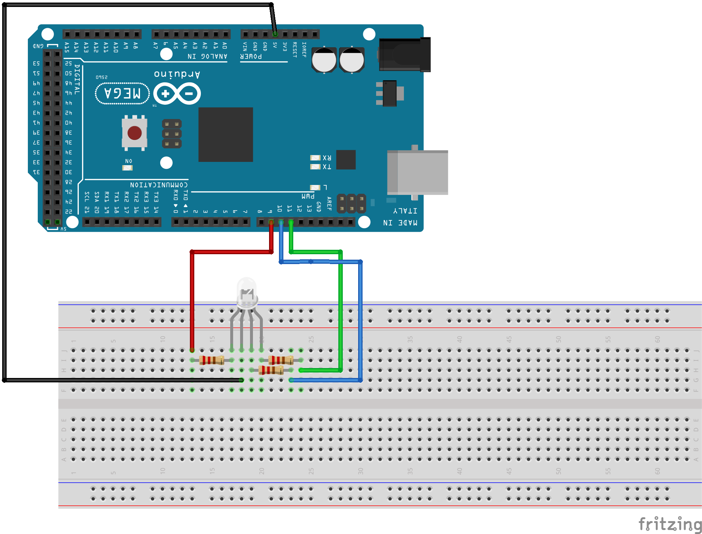

# Práctica 2: Introducción a la electrónica con el LED RGB.
### Rafael Márquez e Illán Garía.

## Objetivo de la practica.
El objetivo de esta práctica es controlar un LED RGB. Se busca comprender su funcionamiento y las particularidades de su conexión. Adicionalmente, se pretende desarrollar la capacidad de programar el arduino para gestionar múltiples salidas digitales de forma coordinada, permitiendo la generación de una paleta de colores, y establecer un sistema de comunicación básico con el usuario a través del puerto serie, integrando así conceptos de entrada y salida de datos.

## Resumen del trabajo realizado.
Para el Ejercicio 1, diseñamos un programa que permite controlar un LED RGB mediante funciones. Debido a que nuestro LED es de ánodo común, tuvimos que adaptar la lógica de encendido y apagado: un estado LOW activa el color y un HIGH lo desactiva. Implementamos una función central gestionarRGB() que recibe como parámetros el color y el estado deseado, lo que facilita el control individual de cada LED. Además, creamos funciones específicas para los colores compuestos que combinan los colores primarios. Destacamos que en el caso del color naranja, utilizamos analogWrite() para ajustar la intensidad de los canales rojo y verde y lograr un tono más preciso. En el bucle principal, probamos cada color con intervalos de 500 milisegundos, verificando así el correcto funcionamiento de todas las funciones implementadas.

En el Ejercicio 2, ampliamos la funcionalidad anterior integrando una interfaz de comunicación serial. El programa queda a la espera de comandos enviados por el Monitor Serie, implementamos un sistema que interpreta cadenas de texto, como "rojo1" o "magenta0", para activar o desactivar los colores correspondientes.

## Particularidades: Problemas encontrados y funcionalidad extra.
El principal problema fue la configuración de ánodo común del LED RGB, que invirtió la lógica de control. Esta particularidad afectó tanto la conexión física como toda la programación, requiriendo modificar las funciones digitalWrite en todas las rutinas de control. Adicionalmente, para generar el color naranja descubrimos que no era suficiente con digitalWrite, ya que necesitábamos mezclar intensidades específicas de rojo y verde, lo que nos obligó a implementar analogWrite con valores PWM concretos para lograr el tono deseado.

Como funcionalidad extra, implementamos un sistema de control de intensidad individual para cada color primario del LED RGB mediante PWM. Esto permite especificar cualquier nivel de intensidad entre 0 y 255 para los colores rojo, verde y azul a través del monitor serial. La función gestionarIntensidadRGB() recibe el nombre del color y el valor de intensidad deseado, aplicándolo directamente mediante analogWrite(). Cabe destacar que, coherentemente con la configuración de ánodo común, un valor de 255 corresponde al apagado total y 0 a la máxima intensidad, aunque la lógica se adapta naturalmente al rango PWM. La interfaz serial guía al usuario en dos pasos: primero solicita el color y luego la intensidad.

## Video del funcionamiento de ejercicio.
### Enlaces Google Drive:
[Video funcionamiento ejercicio 1.1](https://drive.google.com/file/d/18jjhKtVQgEjtd7qumMYaBeQtvoPmYO2B/view?usp=drive_link)

[Video funcionamiento ejercicio 1.2](https://drive.google.com/file/d/1YCpGbx_zTvAVGCrUrMsZ6bpni7f7NVQU/view?usp=drive_link)

[Video funcionamiento ejercicio 2](https://drive.google.com/file/d/1pg4gixRmTCA9MmchJLOAIvQhLPlBG774/view?usp=drive_link)

[Video funcionamiento funcionalidad extra](https://drive.google.com/file/d/1ABJNirGy3v4hSUMtxJvfCsPTSWmmCrb1/view?usp=drive_link)

## Esquemático del circuito.
### Esquema del circuito

