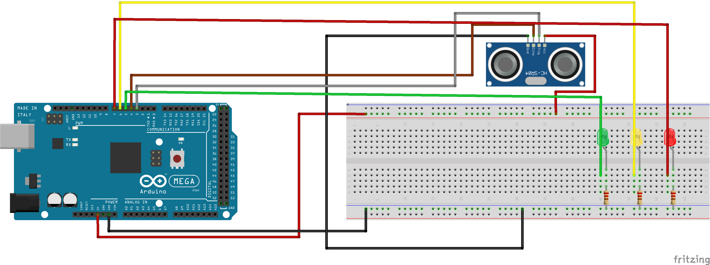
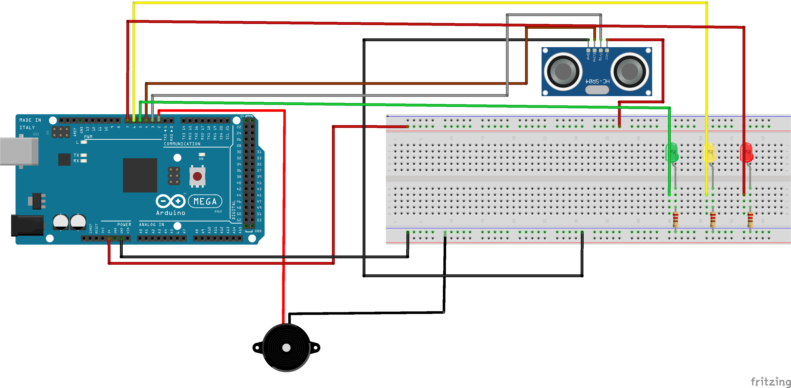

# Práctica 5: uso del sensorde ultrasonidos para medir distancias.

### Rafael Márquez e Illan García.

## Objetivo de la práctica.
El objetivo de esta práctica es aprender a utilizar un sensor de ultrasonidos para medir distancias. A través del montaje del circuito y la programación del sensor, se busca comprender su principio de funcionamiento basado en la emisión y recepción de ondas ultrasónicas, así como aplicar las fórmulas necesarias para calcular la distancia a los objetos detectados. 

Además, se pretende mejorar la interacción con el sistema mediante la implementación de un interfaz visual con tres LEDs que indiquen el nivel de proximidad (seguro, intermedio y peligroso).

## Resumen del trabajo realizado.
En esta práctica hemos implementado un sistema de medición de distancias, cuyo código base se proporcionaba parcialmente en el enunciado. A partir de dicho código inicial, realizamos las conexiones correspondientes entre el sensor y la placa Arduino, además de incorporar tres LEDs indicadores (verde, amarillo y rojo) para mostrar de forma visual la distancia a la que se encuentra un objeto.

El programa realiza el envío de pulsos ultrasónicos a través del pin Trigger y mide el tiempo que tarda el eco en volver mediante el pin Echo. A partir de este valor, se calcula la distancia aplicando la velocidad del sonido en el aire. En función del rango obtenido, se enciende uno de los tres LEDs: el verde cuando el objeto está a una distancia segura (40–60 cm), el amarillo para una zona intermedia (20–40 cm) y el rojo cuando el objeto se encuentra muy cerca (menos de 20 cm).

## Problemas encontrados y funcionalidad extra.
Durante la realización de la práctica se presentaron algunos problemas relacionados con la calibración del sensor de ultrasonidos. En las primeras pruebas, las lecturas de distancia eran inestables o imprecisas, especialmente cuando los objetos eran pequeños o tenían superficies que no reflejaban bien el sonido. Para resolverlo, se realizaron varios ajustes en los rangos de detección y se incorporaron delays más adecuados entre mediciones, consiguiendo así lecturas más estables.

También fue necesario ajustar los umbrales de distancia de los tres LEDs para que la transición entre los colores resultara más lógica y representativa de las distintas zonas (segura, intermedia y peligrosa). Además, se verificó la correcta conexión de los pines del sensor y de los LEDs, ya que un error inicial en el cableado impedía que se encendieran correctamente.

Como funcionalidad extra, se añadió un zumbador conectado al pin 2, que emite señales acústicas según la distancia detectada. Cuando el objeto se encuentra lejos, el zumbador suena de forma intermitente y lenta; a medida que el objeto se aproxima, la frecuencia de los pitidos aumenta, hasta emitir un sonido continuo al entrar en la zona de peligro.

## Video funcionamiento del ejercicio.

[Video funcionamiento ejercicio 1.](https://drive.google.com/file/d/17DmHDjuAIIEp5ZpHJhEiwMtf5rXIsGBP/view?usp=drive_link)

[Video funcionamiento funcionalidad extra.](https://drive.google.com/file/d/1xwuVjUd71WW7JUetFH-kX4GdnnU8ahBn/view?usp=drive_link)

## Esquemático del circuito.
Esquema del circuito del ejercicio 1.

Esquema del circuito funcionalidad extra.

