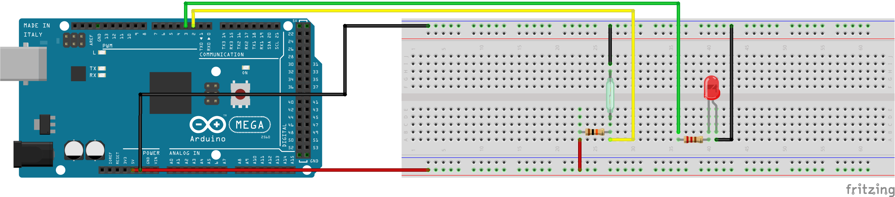

# Práctica 6: Uso de un reed switch como detector de proximidad.

### Rafael Márquez e Illan García.

## Objetivo de la práctica.
El objetivo de esta práctica es construir un sistema capaz de detectar el estado de un interruptor magnético reed switch, utilizado como sensor de puerta abierta/cerrada. 

Para ello, se pretende comprender el funcionamiento del reed switch y aprender a leer su estado correctamente mediante una resistencia pull-up. Finalmente, se busca representar dicho estado mediante un LED indicador.

## Resumen del trabajo realizado.
En esta práctica montamos un circuito usando un reed switch. Conectamos uno de sus terminales a VCC y el otro a un pin de entrada configurado con resistencia pull-up, de modo que el microcontrolador puede detectar en todo momento si el interruptor permanece cerrado o si se abre al alejar el imán.

Tras verificar que la lectura del estado era estable, añadimos un LED al circuito para que mostrara visualmente la situación: LED encendido o apagado según si el reed switch está abierto (simulando puerta abierta) o cerrado (puerta cerrada).

El programa se basa en la lectura periódica del pin digital y actualizar el estado del LED de forma coherente y en tiempo real.

## Problemas encontrados y funcionalidad extra.
Durante la realización de la práctica surgieron algunos problemas relacionados principalmente con la lectura del pin. En las primeras pruebas el estado del interruptor fluctuaba debido a conexiones incorrectas y a la ausencia inicial de resistencia pull-up. Una vez corregido el cableado y configurada adecuadamente la entrada, la lectura pasó a ser estable.

También fue necesario comprobar la orientación y posición del imán respecto al reed switch, ya que distancias o ángulos inadecuados podían impedir que las láminas se abrieran o cerraran correctamente.

## Video funcionamiento del ejercicio.

[Video funcionamiento del ejercicio](https://drive.google.com/file/d/1gcGtLOhpxKWdXFs_eCibUYlWAJrBN_kK/view?usp=sharing)

## Esquemático del circuito.
Esquema del circuito del ejercicio 1.

