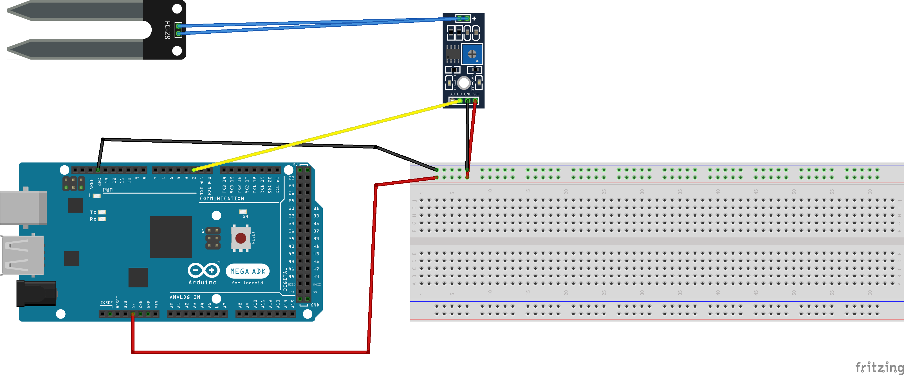
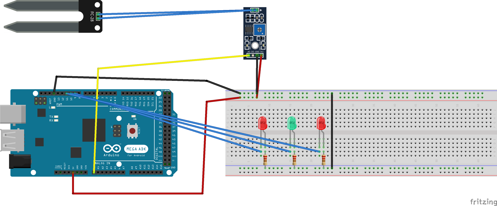

# Práctica 7: Uso del sensor de humedad de suelo FC-28

### Rafael Márquez e Illan García.

## Objetivo de la práctica
El objetivo de esta práctica es aprender a utilizar el sensor de humedad de suelo **FC-28** junto con su módulo comparador **LM393**, entendiendo las diferencias entre la salida **digital (DO)** y la salida **analógica (AO)**.  
Se busca interpretar correctamente el nivel de humedad del suelo y representarlo de manera clara mediante mensajes por monitor serie y mediante LEDs indicadores.

## Resumen del trabajo realizado
En esta práctica montamos dos circuitos diferentes según el modo de lectura utilizado:

### **Ejercicio 1 – Lectura digital (DO)**
Conectamos el pin **DO** del módulo LM393 a un pin digital de Arduino. El módulo compara internamente la humedad con un umbral ajustable mediante el potenciómetro incorporado.  
Implementamos un programa que detecta los cambios de estado del pin usando una **interrupción**, de modo que cada vez que la salida digital cambiaba (de seco a húmedo o viceversa), el sistema imprimía por el monitor serie si el nivel de humedad era **suficiente** o **insuficiente**.

### **Ejercicio 2 – Lectura analógica (AO)**
En este caso utilizamos el pin **AO**, que entrega un valor analógico entre 0 y 1023 según la humedad medida.  
Mediante `analogRead(A0)` interpretamos estos valores y activamos tres LEDs (rojo–verde–rojo) para indicar:

- **Nivel de agua muy alto**
- **Nivel de agua perfecto**
- **Nivel de agua muy bajo**

De esta forma se obtiene una representación visual fácil de entender incluso por usuarios sin conocimientos de programación.

## Problemas encontrados y funcionalidad extra
Durante la práctica surgieron algunos problemas relacionados con:

- **Ajuste del umbral digital:** si el potenciómetro no se regulaba correctamente, la salida DO podía permanecer siempre en un mismo estado.
- **Variabilidad de la señal analógica:** los valores podían fluctuar ligeramente dependiendo de la humedad real del sustrato o de la calidad de las conexiones, por lo que hubo que establecer rangos adecuados.
- **Interpretación inversa del sensor:** el FC-28 genera valores más bajos cuando hay más humedad, lo que obligó a ajustar las condiciones para asegurar lecturas coherentes.

## Video funcionamiento del ejercicio
[Video funcionamiento del ejercicio 1](https://drive.google.com/file/d/1DwEFLDLZS8S_aHE0PL8C6z5eSuoiHB3u/view?usp=drive_link)

[Video funcionamiento del ejercicio 2](https://drive.google.com/file/d/1N38_mDnIUBPLSQ78hWAdq0oecn3he2mY/view?usp=drive_link)

## Esquemático del circuito
Esquema del circuito del ejercicio 1.  

Esquema del circuito del ejercicio 2.  

