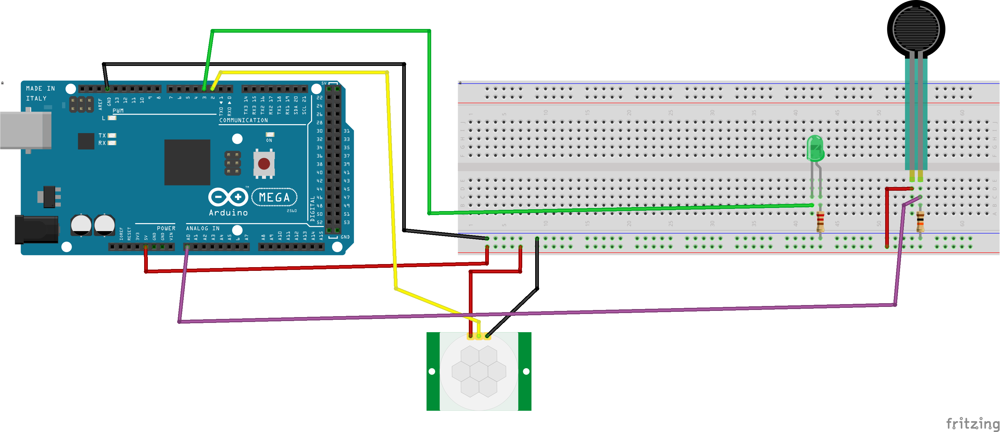

# Práctica 8: Uso del sensor de presión junto con el de presencia.

### Rafael Márquez e Illan García.

## Objetivo de la práctica.
El objetivo de esta práctica es implementar un sistema de iluminación inteligente utilizando un sensor de presencia PIR (HC-SR501) y un sensor de presión FSR.

El propósito es activar el sensor de presencia únicamente cuando el sensor de presión haya sido presionado, evitando así que la iluminación del jardín se encienda por animales u otros elementos no deseados. Si durante ese tiempo se detecta movimiento, un LED se encenderá durante un periodo determinado.

## Resumen del trabajo realizado.
En esta práctica montamos dos circuitos iniciales: uno para leer el sensor de presencia PIR y otro para el sensor de presión FSR. Cada uno fue programado y probado individualmente para verificar su funcionamiento y comportamiento en diferentes situaciones.

Posteriormente integramos ambos sensores en un único sistema. El FSR actúa como un “botón” que habilita la detección de presencia durante un tiempo limitado (30 s). Durante ese intervalo, si el PIR detecta movimiento, el sistema activa un LED que hace la función de luz de jardín.  

El código la lectura analógica del FSR, la lectura digital del PIR y el control del LED utilizando temporización basada en `millis()` para evitar bloqueos y permitir un comportamiento fiable.

## Problemas encontrados y funcionalidad extra.
Durante la realización de la práctica surgieron algunos problemas relacionados con el calibrado del sensor de presencia.  
En el caso del sensor PIR, fue necesario ajustar los potenciómetros de sensibilidad y de tiempo para obtener un funcionamiento estable.

## Video funcionamiento del ejercicio.

[Video funcionamiento del ejercicio](https://drive.google.com/file/d/1dtOnaJI6wbzARyNbvF_rKqkWQgZJELn0/view?usp=sharing)

## Esquemático del circuito.
Esquema del circuito del ejercicio 1.  

